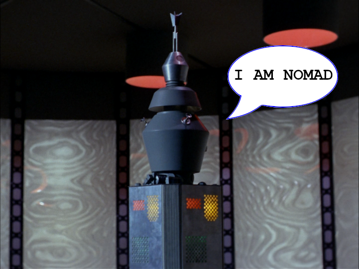

# Project Nomad 

This repo is going to document my journey towards building my own Star Trek Nomad probe.

* [Overview](#overview)
* [Brainstorming and Design](#brainstorming-and-design)

## Overview
Being a kid and Star Trek fan in the late 70’s wasn’t easy. I grew up with 2 TV channels. I had to catch reruns of the original Star Trek series at 1:00am on Saturday nights. I’ve always been enamored with the episode: “The Changeling”

Star Trek and Nomad led me to Electrical Engineering.

Links:
- [Star Trek episode “The Changeling” on Memory Alpha](https://memory-alpha.fandom.com/wiki/The_Changeling_(episode))
- [Nomad on Memory Alpha](https://memory-alpha.fandom.com/wiki/Nomad)

## Brainstorming and Design
Since this project is in the brainstroming stage, updates will be limited to the [Wiki](https://github.com/zxeltor/nomad/wiki)
